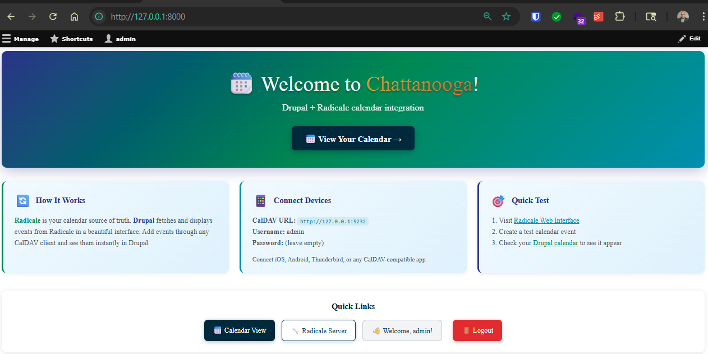
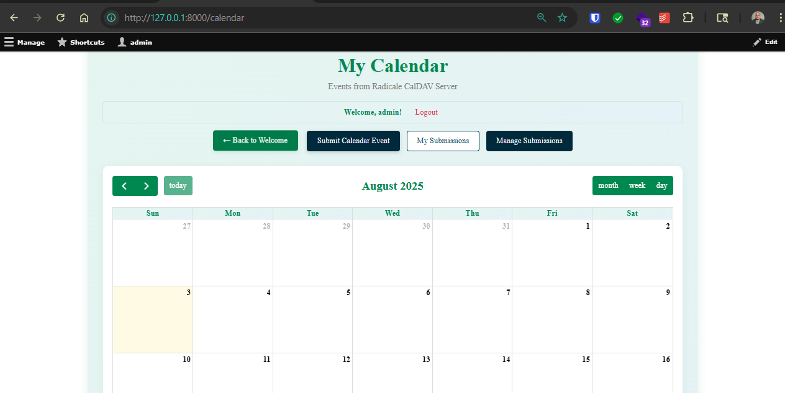
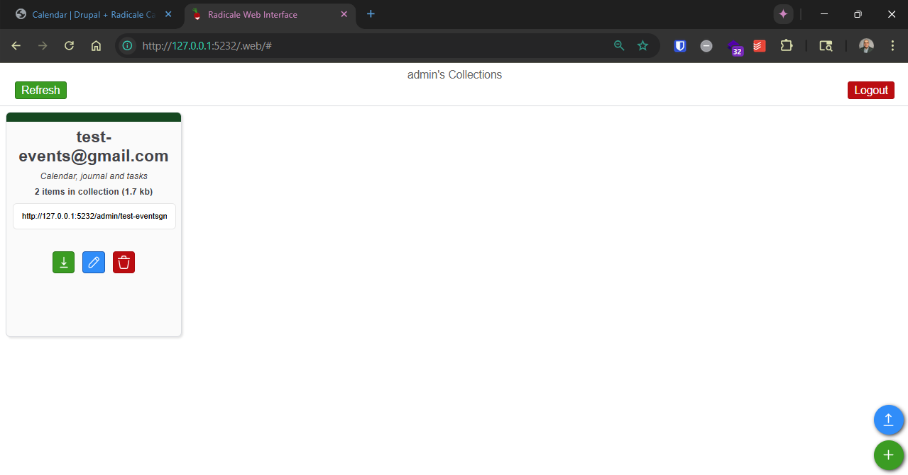

# Drupal 11 + Radicale Calendar Development Template with Submissions

A local development environment for Drupal 11 with integrated Radicale CalDAV server for calendar synchronization. Features a complete calendar submission and moderation workflow system where users can submit events for approval before they're published to the shared calendar.

## Screenshots

**Drupal Welcome Page**


**Calendar View**


**Radicale CalDAV Server**


## Features
- Drupal 11 with custom calendar module that subscribes to Radicale
- Radicale CalDAV server as the main source of truth for calendar events
- Real-time synchronization between Radicale and Drupal
- FullCalendar interface for calendar display
- PostgreSQL database pre-configured for Drupal
- Public event submission form: Anyone can submit calendar events for review
- User registration and login: Custom user management with simplified forms
- Moderation queue workflow: Events sit in moderation queue until approved or rejected
- Immediate publishing: Approved events appear instantly on the calendar
- User dashboard: Users can track their submitted events and their status
- Administrative interface: Moderators can review, approve, or reject submissions
- Role-based permissions: Granular access control for different user types

### User Roles & Permissions
- **Anonymous Users**: Can view calendar and submit events
- **Registered Users**: Can submit events and view their submission history
- **Moderators**: Can review and approve/reject submitted events
- **Administrators**: Full access to all system features and configuration

## Prerequisites

**Required Software:**
- Linux, macOS, or Windows with WSL2 (tested on WSL2 Ubuntu and Linux Mint)
- Git
- Nix Package Manager and devenv

## Setup Instructions

### 1. Clone and Install Dependencies

```bash
git clone <repository-url>
cd drupal_radicale_dev

# Install Nix (if not already installed)
curl -L https://nixos.org/nix/install | sh
source ~/.nix-profile/etc/profile.d/nix.sh

# Install devenv
nix profile add --accept-flake-config github:cachix/devenv/latest
```

### 2. Initialize Environment

```bash
# Make scripts executable
chmod +x setup.sh cleanup.sh

# Run initial setup
./setup.sh

# Enter development environment
devenv shell

# Install Drupal dependencies
cd web && composer install && cd ..

# Start all services
devenv up -d
```

### 3. Install Drupal

1. Open http://127.0.0.1:8000 in your browser
2. Choose "Radicale Calendar Starter" installation profile
3. Enter database credentials:
   - **Database type**: PostgreSQL
   - **Database name**: drupal
   - **Username**: drupaluser
   - **Password**: drupalpass
   - **Click the "Advanced" drop down** and use the following settings: 
     - **Host**: 127.0.0.1
     - **Port**: 5432
4. Complete the installation wizard

**Important**: The installation profile will automatically enable the calendar submission system and set up the moderation workflow.

## Access & User Interface

### Public Access
- **Welcome Page**: http://127.0.0.1:8000/welcome
- **Calendar View**: http://127.0.0.1:8000/calendar
- **Submit Events**: http://127.0.0.1:8000/submit-calendar-event
- **User Registration**: http://127.0.0.1:8000/register
- **User Login**: http://127.0.0.1:8000/login

### User Dashboard
- **My Submissions**: http://127.0.0.1:8000/my-calendar-submissions
  - View all your submitted events
  - Track approval status (Submitted, Under Review, Approved & Published, Rejected)

### Administrative Access
- **Review Submissions**: http://127.0.0.1:8000/admin/content/calendar-submissions
- **System Settings**: http://127.0.0.1:8000/admin/config/content/calendar-submissions

### Radicale CalDAV Server
- **URL**: http://127.0.0.1:5232
- **Username**: `admin`
- **Password**: (leave empty)

## Workflow Process

### For Users Submitting Events

1. **Register/Login**: Create an account at `/register` or login at `/login`
2. **Submit Event**: Go to `/submit-calendar-event` and fill out the form:
   - Event Title
   - Description
   - Start Date & Time
   - End Date & Time
   - Location
3. **Track Status**: Check `/my-calendar-submissions` to see approval status
4. **Publication**: Once approved, events immediately appear in the calendar and Radicale

### For Moderators

1. **Review Moderation Queue**: Go to `/admin/content/calendar-submissions`
2. **Approve/Reject**: Edit individual submissions and change status to "Approved & Published" or "Rejected"
3. **Immediate Results**: Approved events appear instantly on the calendar

### Status Workflow

- **Submitted**: Event is in the moderation queue waiting for review
- **Under Review**: Moderator is actively reviewing the submission
- **Approved & Published**: Event is approved and immediately published to the calendar
- **Rejected**: Event was rejected and will not appear on the calendar

## External Access (for testing CalDAV clients)

To test CalDAV clients from mobile devices or other computers:

1. **Get your computer's IP address:**
   ```bash
   ip address  # Linux/WSL
   ipconfig    # Windows CMD
   ```

2. **Enable firewall access:**
   
   **Linux Mint/Ubuntu:**
   ```bash
   sudo ufw allow 5232
   ```
   
   **WSL2 (PowerShell as Admin):**
   ```powershell
   # Replace [WSL2-IP] with IP from: ip addr show | grep eth0
   netsh interface portproxy add v4tov4 listenport=5232 listenaddress=0.0.0.0 connectport=5232 connectaddress=[WSL2-IP]
   New-NetFirewallRule -DisplayName "Radicale CalDAV" -Direction Inbound -Protocol TCP -LocalPort 5232 -Action Allow
   ```

3. **Connect from external device:**
   - Server: `http://[YOUR-COMPUTER-IP]:5232`
   - Username: `admin`
   - Password: (leave empty)

4. **Disable external access when done:**
   
   **Linux Mint/Ubuntu:**
   ```bash
   sudo ufw delete allow 5232
   ```
   
   **WSL2:**
   ```powershell
   netsh interface portproxy delete v4tov4 listenport=5232 listenaddress=0.0.0.0
   Remove-NetFirewallRule -DisplayName "Radicale CalDAV"
   ```

## Daily Development Workflow

```bash
# Start development session
cd drupal_radicale_dev
devenv shell
devenv up -d

# Check service status
devenv processes

# Clear Drupal cache
cd web 
./vendor/bin/drush cr 
cd ..

# View logs if needed
devenv logs postgres
devenv logs radicale
devenv logs webserver

# End session
exit
```

## Configuration

### Radicale Settings

Configure the Radicale server connection in Drupal:
- **Location**: Configuration → System → Radicale Calendar Settings
- **URL**: `/admin/config/system/radicale-calendar`
- **Default Server**: `http://127.0.0.1:5232`
- **Default Username**: `admin`
- **Default Password**: (empty)

### Calendar Submission Settings

Configure submission system settings:
- **Location**: Configuration → Content authoring → Calendar Submission Settings
- **URL**: `/admin/config/content/calendar-submissions`
- Configure moderation workflow settings
- Set default approval requirements

### User Permissions

Manage who can submit and moderate events:
- **Location**: People → Permissions
- **URL**: `/admin/people/permissions`
- Configure roles for:
  - `add calendar submissions`
  - `view calendar submissions`
  - `edit calendar submissions`
  - `delete calendar submissions`
  - `administer calendar submissions`

## Project Structure

```
drupal_radicale_dev/
├── LICENSE
├── README.md
├── cleanup.sh                   # Environment cleanup script
├── devenv.lock                  # Locked Nix dependencies
├── devenv.nix                   # Nix environment configuration
├── devenv.yaml                  # Devenv metadata
├── docs/                        # Documentation assets
│   └── images/                  # Screenshots and images
├── setup.sh                    # Initial setup script
└── web/                        # Drupal root directory
    ├── composer.json           # PHP dependencies configuration
    ├── recipes/                # Drupal recipes
    └── web/                    # Drupal document root
        ├── modules/
        │   └── custom/
        │       ├── radicale_calendar/      # Core calendar integration
        │       │   ├── config/
        │       │   ├── src/
        │       │   └── templates/
        │       └── calendar_submissions/   # NEW: Submission & moderation system
        │           ├── config/
        │           ├── src/
        │           │   ├── Controller/     # Page controllers
        │           │   ├── Entity/         # Calendar submission entity
        │           │   ├── Form/           # User forms
        │           │   └── Service/        # Immediate publishing service
        │           ├── css/                # Styling
        │           └── templates/          # Twig templates
        ├── profiles/
        │   └── custom/
        │       └── radicale_starter/       # Installation profile
        └── themes/
            └── custom/         # Custom themes directory
```

**Key Directories:**
- **`.devenv/`** - Devenv state including PostgreSQL data and Radicale storage (git-ignored)
- **`web/vendor/`** - Composer packages (git-ignored)
- **`web/web/modules/custom/radicale_calendar/`** - Core calendar integration module
- **`web/web/modules/custom/calendar_submissions/`** - Event submission and moderation system
- **`web/web/profiles/custom/radicale_starter/`** - Installation profile for quick setup

## Database Schema

The system creates additional database tables:
- `calendar_submission` - Main submission entity storage
- `calendar_submission_field_data` - Field data for submissions
- Content moderation tables (provided by Drupal core)

## Troubleshooting

### General Issues

**Permission denied on scripts:**
```bash
chmod +x setup.sh cleanup.sh
```

**Port conflicts:**
```bash
sudo lsof -i :8000
sudo lsof -i :5232
sudo lsof -i :5432
sudo pkill -f process-compose
```

**Services won't start:**
```bash
exit
devenv shell
devenv up -d
```

### Submission System Issues

**Events not appearing after approval:**
- Check that Radicale server is running: `devenv processes`
- Verify Radicale is accessible at http://127.0.0.1:5232
- Check logs for errors: `./vendor/bin/drush watchdog:show --type=calendar_submissions`

**Clear cache after configuration changes:**
```bash
cd web
./vendor/bin/drush cr
cd ..
```

**Check submission logs:**
```bash
cd web
./vendor/bin/drush watchdog:show --type=calendar_submissions
cd ..
```

### Database Issues

**Database connection failed:**
```bash
devenv processes
psql -h 127.0.0.1 -p 5432 -U drupaluser -d drupal
```

**Reset permissions:**
```bash
cd web
./vendor/bin/drush user:role:add administrator admin
cd ..
```

### Reset Environment

If you encounter persistent issues:

```bash
# Exit devenv shell first
exit

# Run cleanup (terminal will freeze - this is normal)
./cleanup.sh

# Close terminal window completely, then open new terminal
cd drupal_radicale_dev
chmod +x setup.sh cleanup.sh
./setup.sh
devenv shell
cd web && composer install && cd ..
devenv up -d
# Reinstall Drupal at http://127.0.0.1:8000
```

## Development Notes

### Customizing the Submission Form

Edit `/web/web/modules/custom/calendar_submissions/src/Entity/CalendarSubmission.php` to modify available fields.

### Modifying the Workflow

1. Go to Configuration → Workflow → Workflows
2. Edit the "Editorial" workflow
3. Add/modify states and transitions as needed

### Extending Functionality

The modular design allows easy extension:
- Add new fields to the CalendarSubmission entity
- Create custom validation rules
- Implement additional notification systems
- Add integration with external calendar services

## Contributing

When contributing:
1. Create feature branches from the main branch
2. Never commit: `.devenv/`, `web/vendor/`, `web/composer.lock`, database dumps, `.env` files
3. Test with fresh clone before submitting PRs
4. Keep credentials and URLs generic
5. Update this README when adding new features
6. Test the submission workflow thoroughly

## Security Considerations

**Development Setup Notes:**
- This setup has no authentication on Radicale for easy development
- Database credentials are hardcoded for development convenience
- User registration is open by default

**For Production Use:**
- Change all default passwords and database credentials
- Enable Radicale authentication
- Configure proper SSL/TLS certificates
- Review and restrict user registration settings
- Set up proper backup procedures
- Configure email notifications for moderation workflow

## Resources

- [Devenv Documentation](https://devenv.sh/)
- [Drupal 11 Documentation](https://www.drupal.org/docs)
- [Drupal Content Moderation](https://www.drupal.org/docs/8/core/modules/content-moderation)
- [Radicale Documentation](https://radicale.org/)
- [CalDAV Protocol](https://tools.ietf.org/html/rfc4791)

## License

MIT License - Copyright (c) 2025 Matt Black

---